#  BiteBuddy — Food Ordering & Delivery App

<p align="center">
  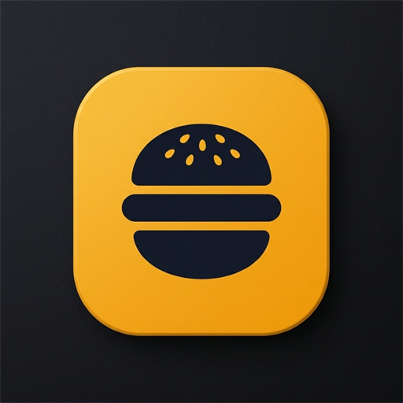
</p>

<p align="center">
  <strong>A modern, full-stack food delivery ecosystem built with Kotlin, Jetpack Compose, and Firebase.</strong>
</p>

<p align="center">
  
  
  
  
  
</p>

---

## 🔗 Quick Links

| Resource | Description | Link |
| :--- | :--- | :--- |
| 🌐 **Live Web Dashboard** | Restaurant Owner Web Management Portal | [**Open Restaurant Web App**](https://khaana-aaba5.web.app/login) |
| 📦 **Download APK** | Latest Android Application Package (`.apk`) | [**Download Latest APK Release**]() |
| 📱 **Mobile App Repository** | Kotlin + Jetpack Compose Source Code | [**GitHub Repository**](https://github.com/Pritam2806/BiteBuddy_App_Kotlin) |
| 💻 **Web App Repository** | React + TypeScript Web Dashboard Source Code | [**Web Dashboard Repository**](https://github.com/Priyansh176/BiteBuddy) |

---

## 📌 Project Overview

**BiteBuddy** is an end-to-end food ordering platform designed for high responsiveness, real-time status updates, and a modern aesthetic.

1. **Android Customer Mobile App** *(Kotlin + Jetpack Compose + Coroutines + Flow)*:
   - Real-time restaurant discovery with open/closed status indicators.
   - Dynamic menu browsing with dual image rendering (Base64 gallery uploads and remote URLs).
   - Single-restaurant cart conflict protection.
   - Cash on Delivery (COD) checkout with flexible delivery address management.
   - Real-time 3-step live order tracking with cancellation & delivery confirmation dialogs.
   - User profile customization with gallery avatar upload and local image compression.
2. **Restaurant Web Dashboard** *(React + TypeScript + Tailwind CSS)*:
   - Restaurant registration, operating status toggle, menu item creation with image uploads.
   - Real-time incoming order management (Accept, Dispatch, Complete, Cancel).
3. **Shared Firebase Backend**:
   - Cloud Firestore with real-time snapshot listeners.
   - Firebase Authentication with customer profile synchronization.

---

## 📱 App Screenshots

<table align="center">
  <tr>
    <td align="center" width="33%">
      <strong>1. Welcome / Sign In</strong><br/><br/>
      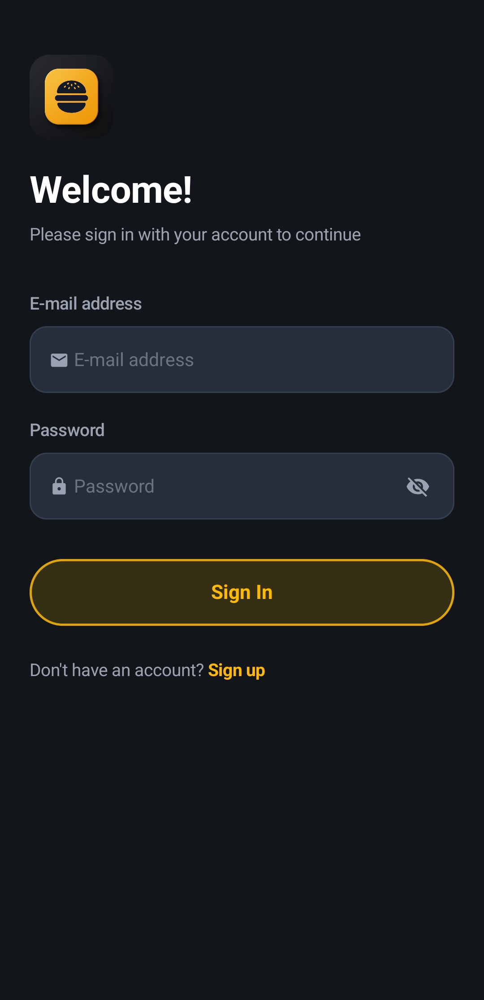
    </td>
    <td align="center" width="33%">
      <strong>2. Sign Up & Profile Setup</strong><br/><br/>
      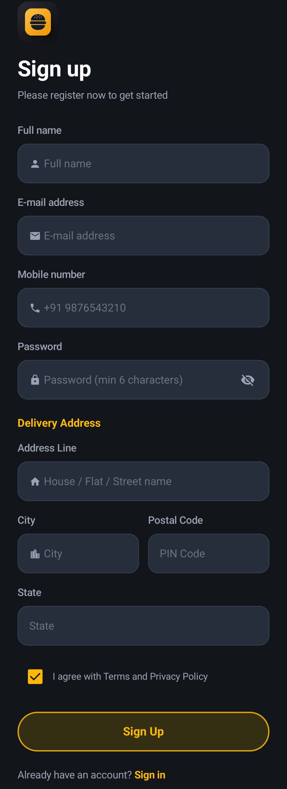
    </td>
    <td align="center" width="33%">
      <strong>3. Home & Discover</strong><br/><br/>
      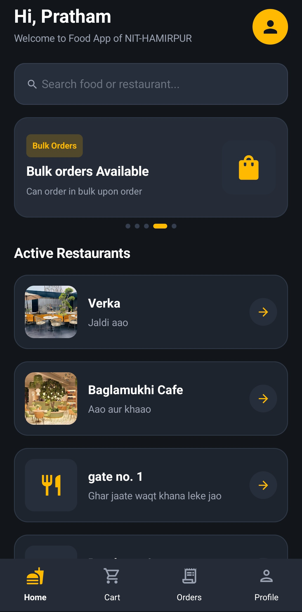
    </td>
  </tr>
  <tr>
    <td align="center" width="33%">
      <strong>4. Restaurant Menu</strong><br/><br/>
      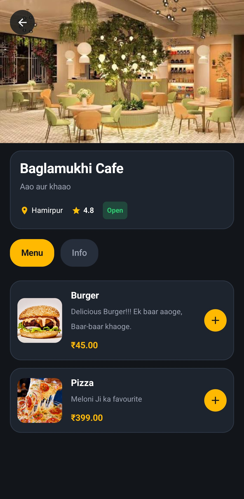
    </td>
    <td align="center" width="33%">
      <strong>5. Food Item Detail</strong><br/><br/>
      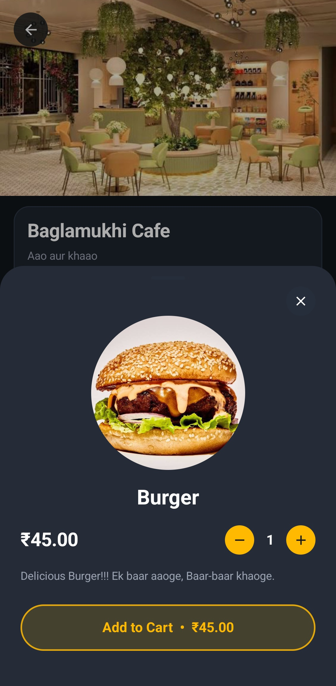
    </td>
    <td align="center" width="33%">
      <strong>6. Single-Restaurant Cart</strong><br/><br/>
      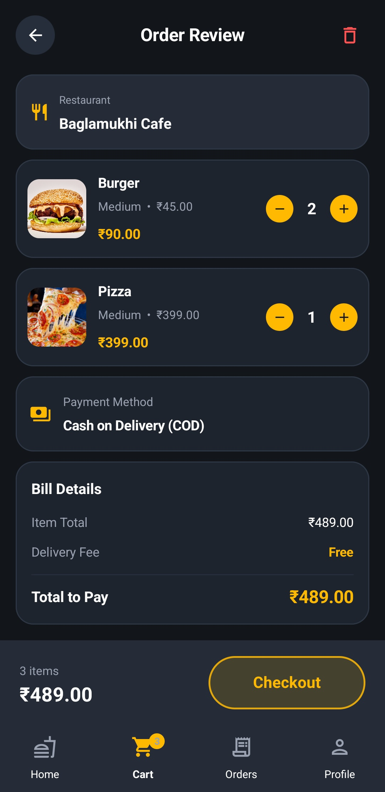
    </td>
  </tr>
  <tr>
    <td align="center" width="33%">
      <strong>7. Checkout (COD)</strong><br/><br/>
      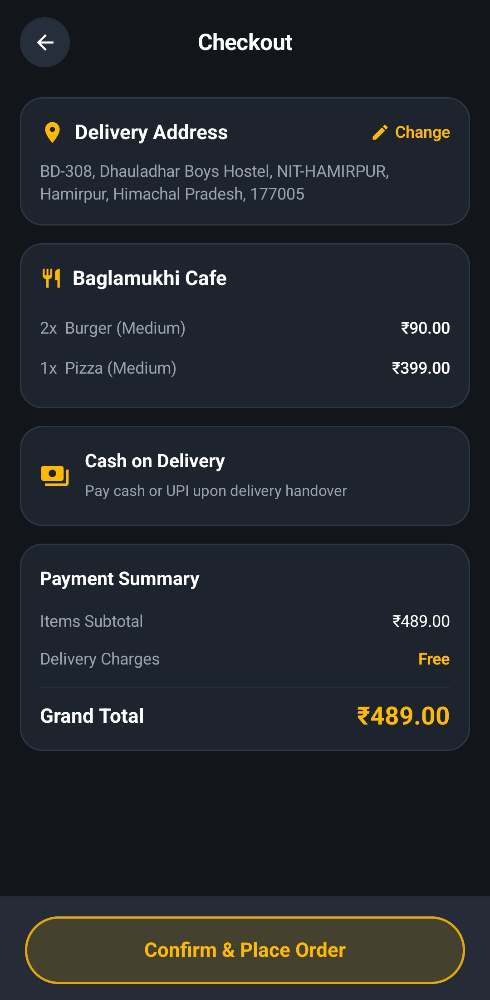
    </td>
    <td align="center" width="33%">
      <strong>8. Live Order Tracking</strong><br/><br/>
      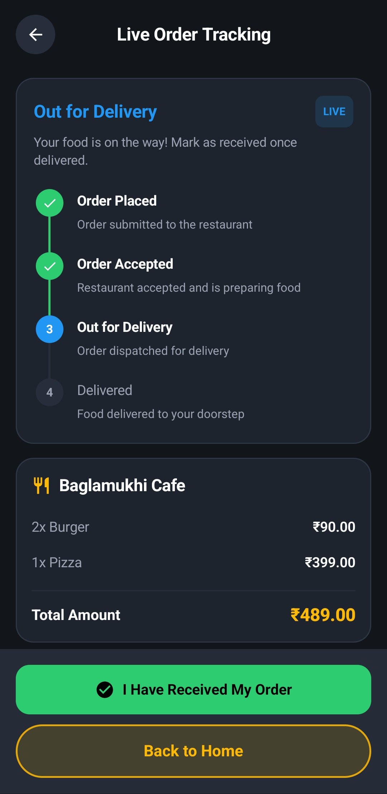
    </td>
    <td align="center" width="33%">
      <strong>9. Order History</strong><br/><br/>
      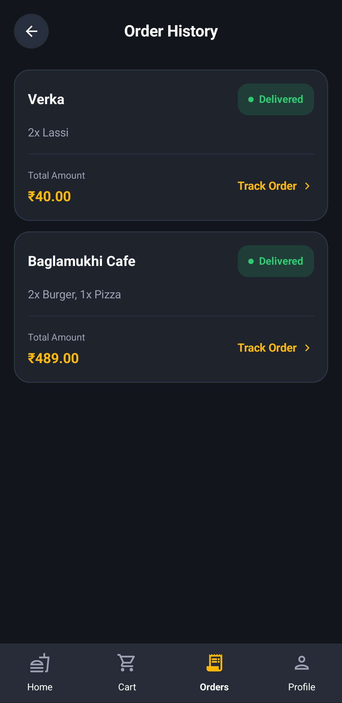
    </td>
  </tr>
  <tr>
    <td align="center" width="33%">
      <strong>10. Profile & Avatar Edit</strong><br/><br/>
      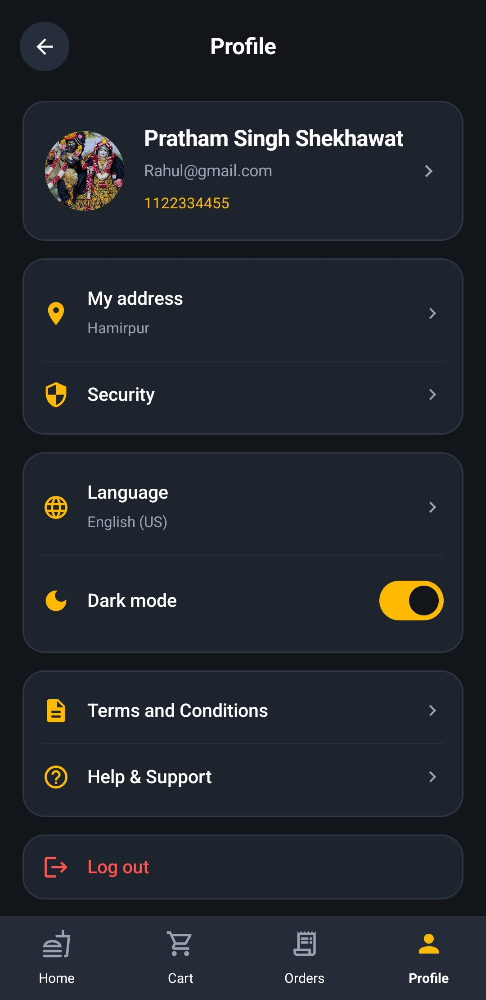
    </td>
    <td align="center" width="33%">
      <strong>11. Delivery Address</strong><br/><br/>
      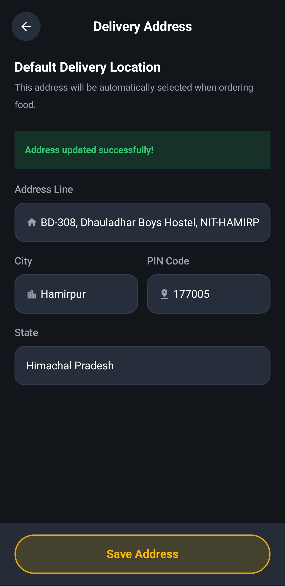
    </td>
    <td align="center" width="33%">
      <strong>12. App Icon & Logo</strong><br/><br/>
      
    </td>
  </tr>
</table>

---

## ✨ Key Features

### 🌟 Customer Experience
- 🌙 **Midnight Charcoal Dark Theme:** Eye-pleasing `#12161A` background accented with `#FFBA00` golden yellow tones and glassmorphic outlined buttons.
- 🏪 **Real-Time Restaurant Discovery:** Browse active restaurants with opening hours, live ratings, delivery estimates, and open/closed badges.
- 🖼️ **Universal Image Support:** Seamlessly decodes Base64 data strings (uploaded directly from device gallery on web/mobile) as well as remote HTTPS URLs via Coil.
- 🛒 **Single-Restaurant Cart Enforcement:** Automatically detects and prompts users with a confirmation dialog before replacing cart items from a different restaurant.
- ⚡ **Auto-Moving Promo Carousel:** Dynamic, responsive top promotion cards that auto-advance smoothly without text wrapping.
- 📍 **Address & Profile Management:** In-app dialogs for updating delivery addresses and editing profile info with device gallery image picker.

### 🔄 Real-Time Order Lifecycle
- **Order Placement:** Directly synchronizes orders to Firestore `/orders` collection with server timestamps.
- **Order Cancellation:** Customers can cancel orders while in `PLACED` status.
- **Delivery Confirmation:** When orders are `OUT_FOR_DELIVERY`, customers can mark them as delivered directly from the tracking screen.
- **Graceful Deletion Handling:** Real-time listeners smoothly handle deleted/purged orders by rendering a clean empty state.

```
┌─────────────────────────┐
│     Customer Places     │
│          Order          │
└────────────┬────────────┘
             │ (status: PLACED) ──▶ [Customer can Cancel Order]
             ▼
      ┌─────────────┐
      │  ACCEPTED   │  • Restaurant confirms order on Web Dashboard
      └──────┬──────┘  • Kitchen prepares the food
             │
             ▼
    ┌──────────────────┐
    │ OUT_FOR_DELIVERY │  • Food is on the way
    └────────┬─────────┘  • [Customer can confirm "I Have Received My Order"]
             │
             ▼
       ┌───────────┐
       │ DELIVERED │  • Order completed and archived in Order History
       └───────────┘
```

---

## 🏗️ Architecture & Tech Stack

```text
com.example.bitebuddy/
├── data/
│   ├── firebase/           # Firebase instance singletons
│   │   └── FirebaseModule.kt
│   ├── model/              # Domain models (UserProfile, Restaurant, MenuItem, Order, etc.)
│   │   ├── Address.kt
│   │   ├── MenuItem.kt
│   │   ├── Order.kt
│   │   ├── Resource.kt
│   │   ├── Restaurant.kt
│   │   └── UserProfile.kt
│   └── repository/         # Repository pattern & Firestore snapshot listeners
│       ├── AuthRepository.kt
│       ├── CartRepository.kt
│       ├── MenuRepository.kt
│       ├── OrderRepository.kt
│       ├── RestaurantRepository.kt
│       └── UserRepository.kt
├── navigation/             # Jetpack Compose Navigation graph
│   └── AppNavigation.kt
├── ui/
│   ├── components/         # Reusable design system (Buttons, Cards, Steppers, Dialogs, Image Loader)
│   │   ├── BiteBuddyButton.kt
│   │   ├── BiteBuddyCard.kt
│   │   ├── EditProfileDialog.kt
│   │   └── ProductImageView.kt
│   ├── screens/            # Application screens
│   │   ├── ActiveOrderScreen.kt
│   │   ├── AddressManagementScreen.kt
│   │   ├── CartScreen.kt
│   │   ├── CheckoutScreen.kt
│   │   ├── HomeScreen.kt
│   │   ├── LoginScreen.kt
│   │   ├── OrderHistoryScreen.kt
│   │   ├── ProfileScreen.kt
│   │   ├── RegisterScreen.kt
│   │   ├── RestaurantDetailScreen.kt
│   │   └── SplashScreen.kt
│   ├── theme/              # Custom Material 3 Dark Theme & typography
│   └── viewmodel/          # Architecture ViewModels with StateFlow
└── MainActivity.kt         # Single-activity Compose entrypoint
```

- **Language:** Kotlin
- **UI Framework:** Jetpack Compose (Material 3)
- **Asynchronous Flow:** Kotlin Coroutines & `StateFlow` / `callbackFlow`
- **Image Loading:** Coil 2.5 + Android `BitmapFactory` for Base64 streams
- **Database & Auth:** Google Cloud Firestore, Firebase Authentication
- **Minimum SDK:** Android 7.0 (API Level 24)
- **Target SDK:** Android 14 (API Level 34)

---

## 🚀 Getting Started

### Prerequisites
- Android Studio Hedgehog (2023.1.1) or newer
- JDK 17
- Android SDK 34
- A Firebase project with Firestore and Authentication enabled

### 1. Clone the Repository
```bash
git clone https://github.com/Pritam2806/BiteBuddy_App_Kotlin.git
cd BiteBuddy_App_Kotlin
```

### 2. Configure Firebase
1. Download `google-services.json` from your [Firebase Console](https://console.firebase.google.com/).
2. Place `google-services.json` inside the `app/` folder:
   ```text
   BiteBuddy/app/google-services.json
   ```

### 3. Build & Install
- **Run in Android Studio:** Open project, sync Gradle, and click **Run** on a device or emulator.
- **Build APK via Command Line:**
  ```powershell
  # Compile debug APK
  .\gradlew.bat assembleDebug

  # APK file location:
  # app/build/outputs/apk/debug/app-debug.apk
  ```

---

##  APK Installation

1. Download the latest `app-debug.apk` from the [GitHub Releases Page](https://github.com/Pritam2806/BiteBuddy_App_Kotlin/releases/latest) or copy it from `app/build/outputs/apk/debug/app-debug.apk`.
2. Transfer the `.apk` file to your Android smartphone.
3. Tap the file to install (enable *"Install from Unknown Sources"* if prompted).
4. Launch **BiteBuddy** and start ordering!

---

## 👥 Authors & Collaboration

- **Android Mobile Developer:** [PritamSingh](https://github.com/Pritam2806)
  - Android Customer Application (Kotlin + Jetpack Compose)
- **Fullstack Web Developer:** [Priyansh](https://github.com/Priyansh176/BiteBuddy)

---

<p align="center">Made with ❤️ for BiteBuddy foodies.</p>